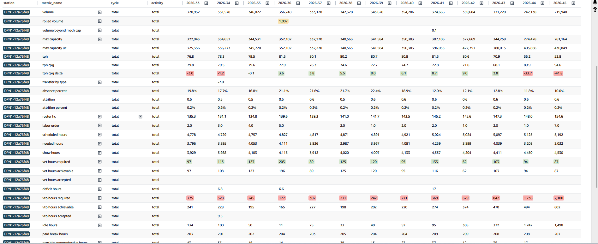
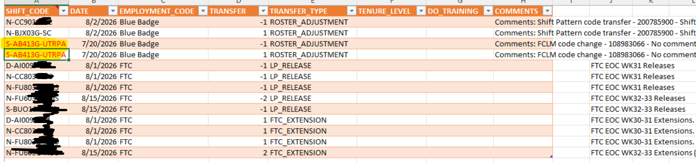
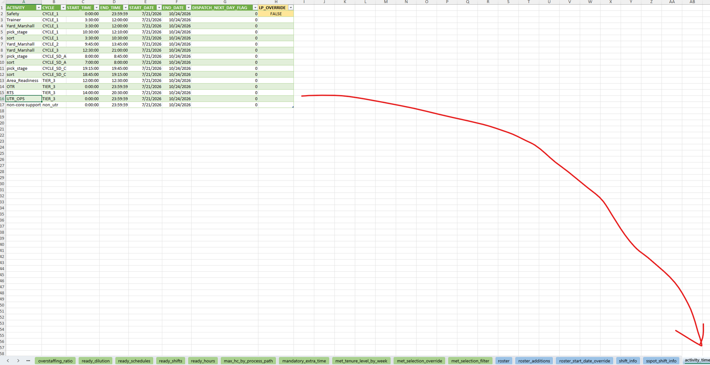
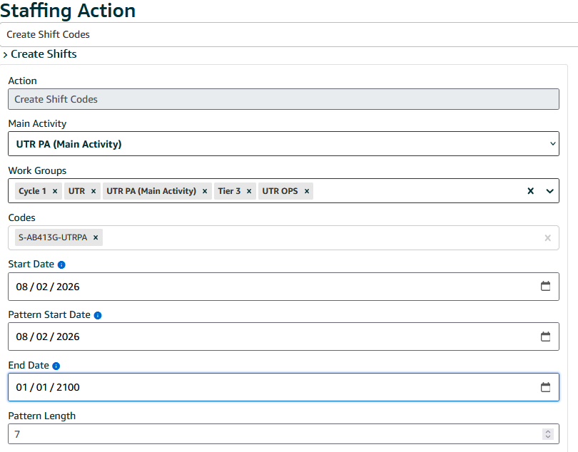

# 📈 Labour Planning

Planning is rarely the same from one day to the next. This section documents common scenarios you may encounter as a Labour Capacity Planning Intern.

---

<details>
<summary>📚 Basic Theory</summary>

<details>
<summary>📦 Volume</summary>

**Volume** is the forecasted number of packages expected to be processed during a planning period.

</details>

<details>
<summary>🔄 Rolled Volume</summary>

**Rolled Volume** is package volume carried over from a previous planning period because it was not processed.

</details>

<details>
<summary>⚠️ Volume Beyond Mechanical Capacity</summary>

**Volume Beyond Mechanical Capacity** is the amount of forecasted volume that exceeds what the site's equipment can physically process.

</details>

<details>
<summary>🏭 Max Capacity</summary>

**Max Capacity** is the maximum volume the site can process under normal operating conditions.

</details>

<details>
<summary>📊 Max Capacity UC</summary>

**Max Capacity UC** is the site's maximum processing capacity expressed as a unit count.

</details>

<details>
<summary>📈 TPH (Throughput Per Hour)</summary>

**TPH** is the average number of packages processed per labour hour.

It is one of the main drivers used to calculate labour requirements.

</details>

<details>
<summary>🎯 TPH QxG</summary>

**TPH QxG** is the target Throughput Per Hour that the labour plan is measured against.

</details>

<details>
<summary>📉 TPH QxG Delta</summary>

**TPH QxG Delta** is the difference between the actual TPH achieved and the planned TPH target.

</details>

<details>
<summary>🔄 Transfer by Type</summary>

**Transfer by Type** shows labour hours transferred into or out of a site, grouped by transfer category.

</details>

<details>
<summary>🚫 Absence %</summary>

**Absence Percentage** is the percentage of scheduled associates expected to be absent during the shift.

</details>

<details>
<summary>👋 Attrition</summary>

**Attrition** is the number of associates leaving the workforce.

</details>

<details>
<summary>📉 Attrition %</summary>

**Attrition Percentage** expresses workforce attrition as a percentage of the total workforce.

</details>

<details>
<summary>👥 Roster HC</summary>

**Roster Headcount (HC)** is the number of associates currently rostered on the schedule.

</details>

<details>
<summary>📝 Labour Order</summary>

**Labour Order** is the staffing request that specifies how many associates are required.

</details>

<details>
<summary>⏰ Scheduled Hours</summary>

**Scheduled Hours** are the total labour hours currently scheduled.

</details>

<details>
<summary>✅ Needed Hours</summary>

**Needed Hours** are the total labour hours required to meet forecasted demand.

</details>

<details>
<summary>🙋 Show Hours</summary>

**Show Hours** are the labour hours actually worked by associates who attend their scheduled shifts.

</details>

<details>
<summary>➕ VET Hours Required</summary>

**VET Hours Required** are the additional voluntary extra-time hours needed to satisfy demand.

</details>

<details>
<summary>📈 VET Hours Achievable</summary>

**VET Hours Achievable** are the number of VET hours that can realistically be filled.

</details>

<details>
<summary>✔️ VET Hours Accepted</summary>

**VET Hours Accepted** are the VET hours associates have accepted.

</details>

<details>
<summary>❗ Deficit Hours</summary>

**Deficit Hours** represent the shortfall between available labour hours and required labour hours.

</details>

<details>
<summary>➖ VTO Hours Required</summary>

**VTO Hours Required** are the voluntary time-off hours needed to reduce excess labour.

</details>

<details>
<summary>📉 VTO Hours Achievable</summary>

**VTO Hours Achievable** are the number of VTO hours that can realistically be offered.

</details>

<details>
<summary>✔️ VTO Hours Accepted</summary>

**VTO Hours Accepted** are the VTO hours associates have chosen to take.

</details>

<details>
<summary>💤 Idle Hours</summary>

**Idle Hours** are paid labour hours where associates are not performing productive work.

</details>

<details>
<summary>☕ Paid Break Hours</summary>

**Paid Break Hours** are paid break periods included within scheduled shifts.

</details>

<details>
<summary>🆕 New Hire Non-Productive Hours</summary>

**New Hire Non-Productive Hours** are labour hours allocated to onboarding and ramp-up activities where new associates are not yet fully productive.

</details>

<details>
<summary>🎓 Ambassador Hours</summary>

**Ambassador Hours** are labour hours allocated to ambassadors responsible for training and supporting new associates.

</details>

<details>
<summary>📚 Dilution Hours</summary>

**Dilution Hours** are labour hours spent on non-productive activities such as meetings, training, or administrative work.

</details>

<details>
<summary>➕ Hours Reallocation (+)</summary>

**Hours Reallocation (+)** represents labour hours reassigned into an activity.

</details>

<details>
<summary>➖ Hours Reallocation (-)</summary>

**Hours Reallocation (-)** represents labour hours reassigned away from an activity.

</details>

<details>
<summary>📈 New Hire TPH Impact</summary>

**New Hire TPH Impact** measures the reduction in expected throughput caused by associates who are still learning.

</details>

<details>
<summary>📊 Gross Excess %</summary>

**Gross Excess Percentage** is the percentage of labour available above the initial requirement before any adjustments.

</details>

<details>
<summary>📉 Net Excess %</summary>

**Net Excess Percentage** is the remaining labour excess after reallocations and adjustments have been made.

</details>

<details>
<summary>🛤️ ADTA FPP %</summary>

**ADTA Flow Path Percentage (FPP)** is the proportion of volume processed through the Automated Direct-to-Aisle flow path.

</details>

<details>
<summary>🧭 Flow Path Percentage</summary>

**Flow Path Percentage** is the percentage of total package volume routed through each operational flow path.

</details>

<details>
<summary>📦 Volume Processed</summary>

**Volume Processed** is the actual number of packages successfully processed during the planning period.

</details>

</details>

<details>
<summary>🖥️ Example Horizon Dashboard</summary>

This section provides an overview of the Horizon dashboard and explains the purpose of each key area used during Labour Planning.

### 📊 Dashboard Overview



### 📌 Key Sections

- 📦 **Forecast Volume** – Displays the expected package volume.
- 📈 **TPH** – Current and target throughput per hour.
- 👥 **Headcount (HC)** – Planned workforce.
- ⏰ **Scheduled Hours** – Total labour hours currently rostered.
- ✅ **Needed Hours** – Labour hours required to meet demand.
- ➕ **VET** – Additional hours required.
- ➖ **VTO** – Hours that can be reduced.
- 📊 **Capacity Metrics** – Site capacity and utilisation.

### 💡 Tip

Hover over most metrics within Horizon to view additional information or calculation details.

</details>

---

<details>
<summary>⚙️ Setting Up Your Environment</summary>

<details>
<summary>💻 Setting Up EU AMZL RDS ODBC</summary>

Follow the steps in this guide:

https://w.amazon.com/bin/view/AMZL-EU-PANDA/BI/NewJoinee/SA_Planning/Setting_RDS

</details>

</details>

---

<details>
<summary>👷🏼 Practical Labour Planning</summary>

<details>
<summary>👷🏼‍♂️ First Step: Roster Validation</summary>

## 📖 The Big Picture: Why Roster Validation Exists

ALPS decides how many people **the station (e.g,. DAB1)** needs each shift. To do that, it first needs to know **who is actually expected to work next week**.

However, associates are constantly:
- Joining
- Leaving
- Transferring
- Changing shifts

These changes are recorded in a separate **Roster Changes** file.

Your job during **Roster Validation** is to ensure the **ALPS Inputs File** accurately reflects those changes **before** the labour plan is generated. Missing or incorrect roster changes can result in understaffing, overstaffing, or incorrect labour calculations.

### 💡 Think of it like this

```text
┌──────────────────────────────┐        Validate        ┌──────────────────────────────┐
│     ROSTER CHANGES FILE      │ ───────────────────▶   │         INPUTS FILE          │
│                              │                       │                              │
│  Source of truth from Ops    │                       │  Used by ALPS to build the  │
│  • Joiners                   │                       │  labour plan                 │
│  • Leavers                   │                       │                              │
│  • Shift changes             │                       │                              │
│  • Transfers                 │                       │                              │
└──────────────────────────────┘                       └──────────────────────────────┘
```

If the **Inputs File** doesn't match the **Roster Changes File**, ALPS will generate an incorrect labor plan.


---

## 📝 Steps

### 1️⃣ Download the latest Inputs File

Open **ALPS** on your desktop (ensure you're using the latest version) and download the most recent **Inputs File** for your station.

---

### 2️⃣ Open the Roster Changes folder

Navigate to:

```text
\\ant\dept\LMA\EU Capacity Planning\ALPS\Roster Changes\UK\[Station Name]
```

This folder contains the latest **Roster Changes** file for your site.

---

### 3️⃣ Open the Transfers worksheet

Within the **Inputs File**, open the **Transfers** worksheet (`Transfer_Type`).

This sheet records associates transferring into or out of the station.

---

### 4️⃣ Find the associate

Copy the associate's **Employee ID** from the Transfers sheet.

---

### 5️⃣ Validate against the Roster

Open the **Roster** worksheet (the current live roster).

Paste the Employee ID and use **XLOOKUP** to confirm whether the associate already exists in the roster.

```excel
=XLOOKUP(EmployeeID, Lookup_Array, Return_Array, "Not Found")
```

If the employee is **not found**, investigate whether they should be added or whether the transfer information is incorrect.

---

<details>
<summary>👷🏼 Planning Example for DAB1</summary>

The final horizon result: https://horizon.harmony.a2z.com/horizon/amzl/alpx?plan_id=594feb1a-4d36-42c8-b9ec-bf23fc2f38dd

### First step: download both of the files and open them side by side


*Roster tab = a big list: employee ID → the shift code they're on right now.*

*Transfers tab = a list of adjustments: "add a head here (+1), remove a head there (−1).*


Your 3 employees from the RV file

_

_Two are leavers (no future code — they're just gone). One is a transfer (moving from one shift to another)._

### The key question the XLOOKUP answers

For each person, you must find out: "What shift code does the Roster tab currently have them on?" Because that decides whether the change is already done or still needs doing.
XLOOKUP is just an automatic lookup. Here's the mechanic, visually:


_

So it walks down column A until it hits 207742861, then jumps sideways to column I and hands you the shift code on that row. That's all it does — "find this person, tell me their current shift."
(The Find & Replace you tried earlier searched for the code — it found lots of rows but couldn't tell you whose they were. XLOOKUP pins it to the person. That's why it's the right tool.)


<details>
<summary>📊 The Decision, as a Flowchart</summary>


Your result was **N-FU403G-NDS** → the **old code** → **roster not updated yet** → **keep the transfer**. ✅

</details>


<details>
<summary> Why "keep" is correct — the −1 / +1 mechanic</summary>


Since the Roster tab still shows this person on the old shift, ALPS needs both nudges: pull them off the old one, place them on the new one. Net effect = the transfer. That's exactly what rows 4 & 5 do — so they're right, untouched.
If the roster had already shown the new code, both these rows would be double-counting (the roster would show them on the new shift and the transfers tab would add another head to it) — that's the case where you'd delete them.


</details>


<details>
<summary> Releases vs Transfers vs Extensions</summary>

These are the three TRANSFER_TYPE values in your file. Here's how each behaves:


Since the Roster tab still shows this person on the old shift, ALPS needs both nudges: pull them off the old one, place them on the new one. Net effect = the transfer. That's exactly what rows 4 & 5 do — so they're right, untouched.
If the roster had already shown the new code, both these rows would be double-counting (the roster would show them on the new shift and the transfers tab would add another head to it) — that's the case where you'd delete them.


</details>


<details>
<summary>📊 How to Add Shift Codes into SSPOT</summary>

Sometimes in the **Transfers** tab, you may notice shift codes highlighted in red.



This means that those shift codes need to be added into **[SSPOT](https://sspot.dub.corp.amazon.com/)**.

The process can be divided into two steps:

---

<details>
<summary>1️⃣ Step One: Identify the Main Activity and Work Groups</summary>

Open the `activity_time` tab in the Inputs File.

Use this tab to identify:

- The correct **cycle**
- The correct **main activity**
- The relevant **work groups** associated with the shift code



> **Important:**  
> In SSPOT, the cycle information from the `activity_time` tab is used to help determine the correct work groups.

</details>

---

<details>
<summary>2️⃣ Step Two: Create the Shift Code in SSPOT</summary>

Open **[SSPOT](https://sspot.dub.corp.amazon.com/)** and select the correct site.

Then:

1. Go to **Staffing Actions**.
2. Select the **Create Shift Codes** staffing action.
3. Select the correct **Main Activity** identified in the `activity_time` tab.
4. Select the relevant **Work Groups** associated with the shift code.
5. Enter the required shift code, for example:

   `S-AB413G-UTRPA`

6. Set the **Start Date** to a date in the previous week.
7. Complete the remaining date and pattern fields as required.



> **Important:**  
> Each shift code can only have one main activity.

> **Note:**  
> Using a date from the previous week is a general rule of thumb. Some stations may request that a shift code begins from a specific date.

</details>

</details>

---

✅ **Outcome**

By the end of this process:

- The **Roster Changes File** and **Inputs File** should match.
- Every transfer has been validated.
- SSPOT configurations has been sorted
- ALPS can generate an accurate labour plan using the correct staffing data.

</details>

</details>


<details>
<summary>👷🏼‍♂️ Second Step: Running the input files into ALPS</summary>


<details>
<summary>👷🏼 </summary>
